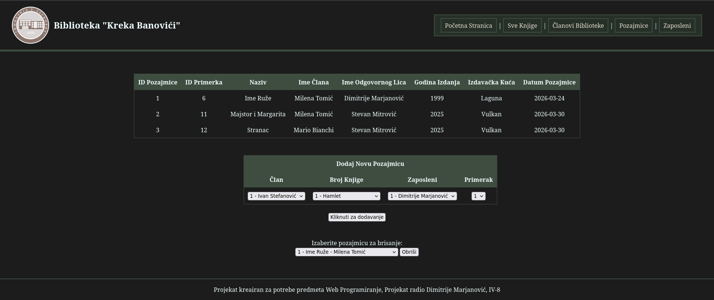

# Library "Kreka Banovici"

[](#) 
[](#)
[](#)

Library "Kreka Banovici" is a locally-hosted interactive web application designed for managing a library system.
It was made for a school project in the class "Web Devlopment 1".

## Features
The library can be used for managing the different aspects of running a library of the home variety, with additional
features in case of third-parties (public and/or private libraries) who wish to use this repository.

The program's features currently include pages for:
* Viewing all the books in the library's database
    * Also includes adding more books to said database
* Viewing all the members of said library, as well as if they paid their membership
    * Also includes includes the ability to add or remove members, as well as check them off if they paid their yearly membership fee
* Viewing all the books that are currently loaned away to members
    * Also includes adding new loans, as well as releiving said loans

## Installation

> [!NOTE]
> The application is provided with a pre-existing placeholder database. To install the program **WITH** said placeholder, simply run
> the autorun.ps1 file.

### Windows
After opening PowerShell in the directory where the files are located, run the command `python --version` to check if python is installed on the machine.
If the command returns `Python 3.13.5` (or any other version of python), you may proceed. If not, install the newest version of python from the official site or
the Microsoft Store.

Then run:
```powershell
python -m venv venv || py -3 -m venv venv
```
To initialise the virtual environment, run `venv/Scripts/Activate`. After the virtual environment is successfully installed, you can **optionally**
choose to upgrade *pip* by running the command `py - m pip install --upgrade pip`.

To setup flask, simply install it via running the following command:
```powershell
pip install flask || py -m pip install flask
```
You can check whether flask was successfully installed via the command `pip show flask`. If it returns the flask version, it means that everything has been
installed successfully.

Run the `create_tables.py` program, to initialise the database, and, *optionally*, also run the `insert_tables.py` program
to fill the database with placeholder values.

You can start the app by running the following commands, which will automatically start everything.
```powershell
Start-Process powershell -ArgumentList "flask run --port 5001"
Start-Sleep -Seconds 3
Start-Process "http://127.0.0.1:5001"
```

### Linux (Debian)
After opening your terminal emulator of choice in the directory of the repo, run the command `python3 --version` to check if python is installed on the machine.
If the command returns `Python 3.13.5` (or any other version of python), you may proceed. If not, install the newest version of python by running the following commands,
which will be sure to return the Python version and pip version at the end if everything installs correctly.
```bash
sudo apt update
sudo apt install python3 python3-pip python3-venv
python3 --version
pip3 --version
```

Then run:
```bash
sudo python3 -m venv venv
```
To initialise the virtual environment, run `./venv/Scripts/Activate`. After the virtual environment is successfully installed, you can **optionally**
choose to upgrade *pip* by running the command `sudo py - m pip install --upgrade pip`.

To setup flask, simply install it via running the following command:
```bash
pip install flask
```
You can check whether flask was successfully installed via the command `pip show flask`. If it returns the flask version, it means that everything has been
installed successfully.

Run the `create_tables.py` program, to initialise the database, and, *optionally*, also run the `insert_tables.py` program
to fill the database with placeholder values.

You can start the app by running the command `flask run`, and opening your browser to `https://127.0.0.1:5000`.

## Screenshots

